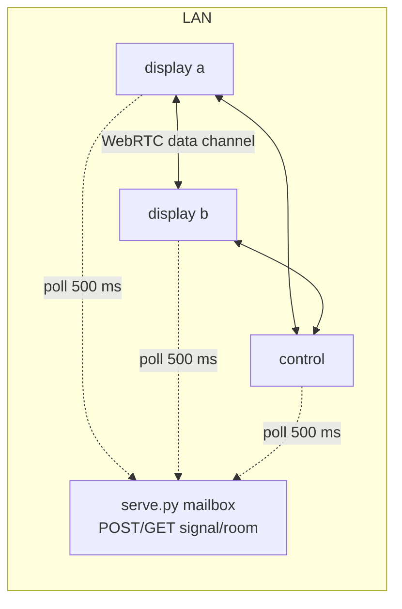
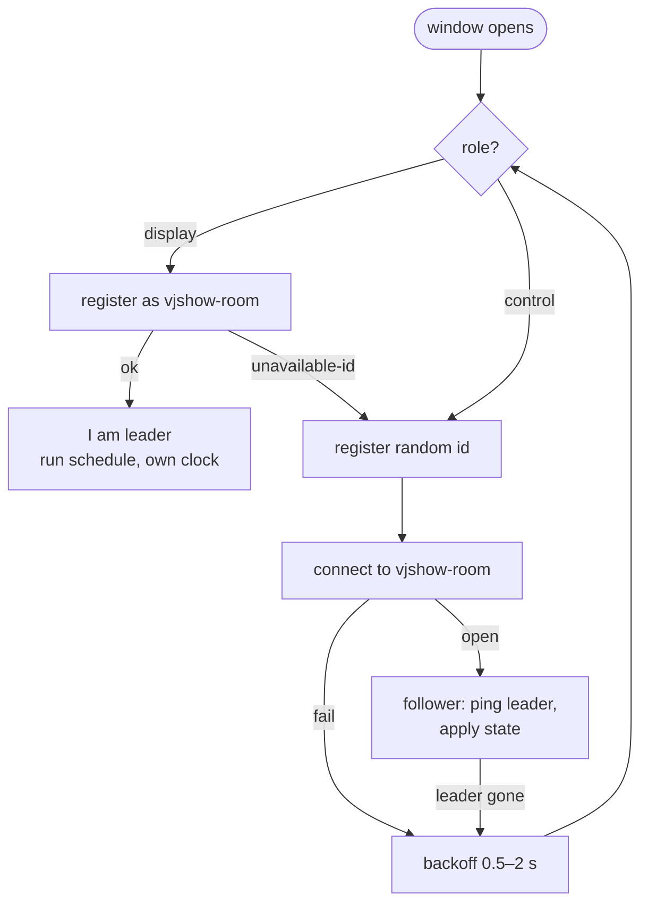
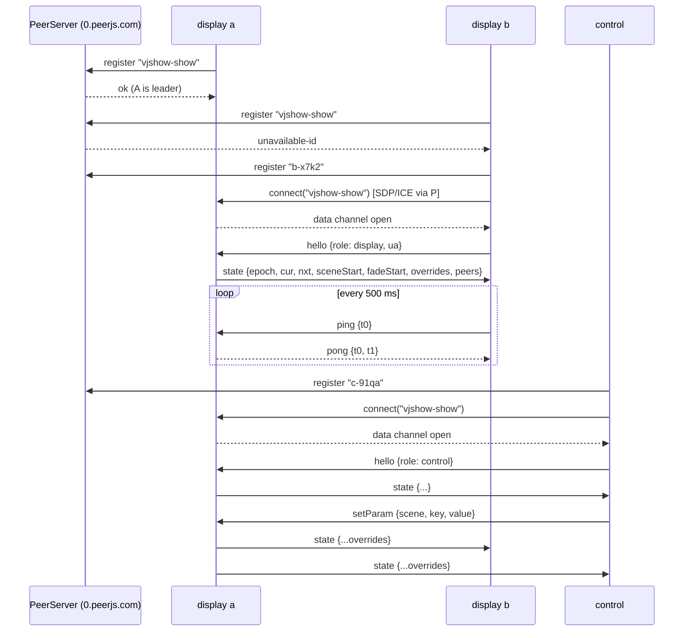

# RFC 0001: Serverless sync

| | |
|---|---|
| Status | Draft |
| Date | 2026-09-20 |
| Scope | How displays and controllers find each other and elect a leader when there is no `serve.py`, so a copy served from GitHub Pages (or any static host) syncs across displays. |
| Not in scope | The clock sync, state broadcast, param overrides and tiling protocol. Those don't change. |

## 1. Motivation

The original brief asked for a player you can launch on venue hardware by opening a URL,
with nothing to install. The GitHub Pages copy delivers that for one display and for a
standalone control page, but not for a synced wall, because sync needs a signaling
channel and the only one we have is the mailbox in `serve.py`. On Pages every
`signal/` request is a 404, so each window leads itself.

The goal is: two laptops on the venue Wi-Fi each open
`https://dnuke-art.github.io/vj-show/?grid=2,1&tile=…` and show one animation, and a
phone opens `?mode=control` and drives them, with no machine on the LAN running anything.

The LAN server stays. It's the reliable path for an installation, and it's the only
path that supports *save to scenes.json*. This RFC adds a second signaling backend, it
doesn't replace the first.

## 2. Background: what sync is today



1. Every window polls a per-room mailbox on `serve.py` and posts `hello`.
2. Pairs exchange SDP offers/answers and ICE candidates through the mailbox and open a
   WebRTC data channel. Every pair connects: a full mesh.
3. The lowest id among *display* peers is leader. Control peers never lead. A controller
   with no display leads itself so its program monitor runs.
4. The leader owns the show clock and the schedule and broadcasts state once a second
   and on every change. Followers NTP-ping the leader and slew onto its clock.

Two observations drive the design below:

- **Only the leader needs to talk to everyone.** Every message is leader→all (state) or
  peer→leader (ping, setParam, jump, skip). Follower↔follower links carry nothing. The
  mesh was convenient, not necessary. A star is enough.
- **Signaling is only needed to open a channel.** Once the channel is up the server is
  irrelevant, and the protocol on the channel is already transport-agnostic JSON.

## 3. Design

### 3.1 Two signaling backends behind one interface

```
Transport
  start(room, role)                 // begin discovery / connection
  send(peerId, msg)                 // to one peer
  broadcast(msg)                    // leader → all followers
  on('open', (peerId, role, ua))    // a channel opened
  on('close', peerId)
  on('message', (peerId, msg))
  leaderId                          // who leads, or null while unknown
  isLeader
```

- `MailboxTransport`: the existing `serve.py` path, re-shaped as a star (see 3.5).
- `PeerJsTransport`: new, uses the PeerJS library and a PeerJS signaling server.

Selection, in order: `?signal=mailbox|peerjs` on the URL; `sync.signal` in
`scenes.json`; otherwise auto-detect by fetching `signal/<room>?since=0` once. JSON back
means the mailbox is there; anything else (a 404 page on GitHub) means PeerJS.

### 3.2 PeerJS in one paragraph

[PeerJS](https://peerjs.com) wraps `RTCPeerConnection` with a tiny signaling protocol:
a peer registers an id with a PeerServer over a WebSocket, and any other peer that knows
that id can open a data connection to it. PeerJS runs a free public PeerServer
(`0.peerjs.com`), and `npx peer` runs your own in one line. Nothing about the data
channel changes; PeerJS only does the part `serve.py` does today. The library is one
script from a CDN, about 60 KB.

### 3.3 Rooms as well-known ids, election by claim

PeerServer has ids, not rooms. So the room *is* an id: `vjshow-<room>`, sanitized to
`[A-Za-z0-9_-]`. Whoever holds it is the leader.

- A **display** starts by trying to register as `vjshow-<room>`. Success means it is the
  leader. `unavailable-id` means someone else already is: register with a random id and
  connect to `vjshow-<room>` as a follower.
- A **control** never claims. It registers with a random id and connects to the leader
  id, retrying until a display shows up. Until then it leads itself, as today.

This replaces "lowest id wins" with "first display wins," which is fine: the property we
need is that exactly one display leads and controls never do, and both hold.



### 3.4 Startup and steady state



Everything after "data channel open" is the existing protocol, byte for byte. The
`state` message gains a `peers` list (ids, roles, user agents) so the control page can
show which tiles are connected without having its own link to each of them.

### 3.5 Failover

```mermaid
sequenceDiagram
  participant P as PeerServer
  participant A as display a (leader)
  participant B as display b
  participant C as control
  Note over A: tab closed / laptop lid shut
  B--xA: channel closed
  C--xA: channel closed
  Note over B,C: keep rendering from last state<br/>and own (already synced) clock
  B->>B: backoff 0.5–2 s
  B->>P: register "vjshow-show"
  P-->>B: unavailable-id (server still holds A's id)
  B->>B: backoff, retry
  B->>P: register "vjshow-show"
  P-->>B: ok  (B is leader)
  Note over B: continues schedule from its mirrored state;<br/>no jump, clock offset kept
  C->>B: connect("vjshow-show")
  B->>C: state {...}
```

Key property: a follower's local copy of `{epoch, cur, nxt, sceneStart, fadeStart,
overrides}` plus its slewed clock *is* the show. A follower that becomes leader just
stops slewing and starts scheduling. Nothing on screen changes. The old leader's id is
released by PeerServer after its socket dies, which can take a few seconds; the claim loop
just keeps trying. Control peers keep rendering their program monitor from the last state
meanwhile.

The mailbox backend gets the same shape: followers connect only to the leader, and if the
leader vanishes the lowest remaining display id takes over, as today.

### 3.6 Connectivity

- **Same LAN** (the normal case, two laptops on venue Wi-Fi): ICE host candidates connect
  directly. Chrome publishes host candidates as mDNS names; on a normal LAN that resolves.
  PeerJS adds Google's STUN by default, which also covers most NATs.
- **Different networks**: STUN gets through most home and venue NATs. Symmetric NAT
  needs TURN. We don't provide one; the status line says "connecting…" forever and the
  README says why. Not a target.
- **Client isolation Wi-Fi** (some venues block device-to-device traffic): host
  candidates fail and STUN reflexive candidates may too. Same answer: not a target; use
  the LAN server on a machine with a wired connection, or a hotspot.

### 3.7 Security

The public PeerServer is open, and the leader id is derived from the room name. Anyone
who knows the room name can register a "display" and, if they win the claim, run the
show. Two mitigations, both cheap:

1. **Room names are tokens, not words.** `"room": "show"` is fine on a LAN behind
   `serve.py`; on the public server the default should be a generated token, and the
   README says so.
2. **Shared key in `hello`.** `sync.key` in `scenes.json` (or `?key=`) is sent in the
   first message on every channel. The leader closes channels whose key doesn't match;
   followers close channels to a leader whose key doesn't match. Signaling traffic is on
   TLS to the PeerServer and the data channel is DTLS, so the key isn't visible on the
   wire.

That's not authentication, it's a shared secret, and it's the right level for "don't let
a stranger who guesses the URL hijack the wall."

### 3.8 What doesn't work from a static host, on purpose

- **Save to scenes.json.** There's no file to write. The button says so and stays
  disabled. Overrides still live in the leader and sync to everyone; they just don't
  persist. Copying the merged JSON to the clipboard is a reasonable substitute.
- **Hot reload** still works, since it's a `fetch` of static files, but it's Pages'
  deploy cadence, not a local edit loop.

## 4. Failure modes

| Situation | Behaviour |
|---|---|
| PeerServer unreachable | Every window leads itself. Status line: "no signaling: running standalone". Retry every 10 s. |
| Leader tab hidden > 5 min (Chrome intensive throttling) | Leader's timers slow to once a minute; state broadcast stalls. Followers keep rendering on their own clock. Fix is operational: a display is a visible fullscreen window. Recorded in the README. |
| Follower loses channel | Keeps rendering from last state; reconnect loop; clock offset kept. |
| Two displays claim at once | PeerServer serializes registrations; exactly one wins. The loser gets `unavailable-id` and follows. |
| Stale leader id after crash | Claims fail for a few seconds until the server releases it; backoff and retry. |
| Wrong key | Channel closed immediately; status line: "rejected: wrong key". |
| Free PeerServer has an outage | Same as unreachable. For an installation, run `npx peer` on a LAN machine, or use `serve.py`. |

## 5. Implementation plan

1. Extract the transport interface from `index.html` and move the existing mailbox code
   behind it. Switch it to a star while doing so. No behaviour change on the LAN; this
   is the risky refactor and should land alone.
2. Add `PeerJsTransport` with claim-or-connect, backoff and the `peers` list in `state`.
3. Auto-detect backend; `?signal=` and `sync.signal` overrides.
4. `sync.key` handshake on both transports.
5. Control page: disable *save* when the transport has no server; show the peers list from
   `state`.
6. README and a "hosted, synced" section. Change the default room in `scenes.json` to a
   generated token when the mailbox isn't present, or leave `show` and document it.

Rough size: 1 is half a day, 2–5 a day, 6 an hour. Test matrix: two Chrome tabs on
Pages; two machines on one Wi-Fi; a phone as control on the same Wi-Fi; kill the leader
and watch the wall not flicker.

## 6. Alternatives considered

- **Manual signaling** (copy-paste SDP between windows, or QR codes). Works with zero
  infrastructure, but a wall of four displays is twelve pastes and a reconnect means
  doing it again. Fine as a demo, not as an operating mode.
- **Trystero** (rooms over public BitTorrent trackers, Nostr or MQTT brokers, no
  account). Gives real room semantics so the "lowest id leads" election could stay
  as-is, and is the fallback if claim-by-id turns out flaky on the public PeerServer.
  Heavier (a few hundred KB, crypto handshake), and the public trackers are as
  best-effort as the PeerServer. Worth keeping in mind; not the first choice.
- **A hosted signaling service** (Firebase Realtime, Supabase Realtime, Cloudflare
  Durable Objects). Reliable, but needs an account and a key in the page, and makes the
  static copy depend on a second service. Better than PeerJS only if the free
  PeerServer proves unreliable in practice.
- **Serving the mailbox from a tiny cloud function** and pointing Pages at it. Same
  dependency shape as a hosted service with more code to own.

## 7. Open questions

- Is the public PeerServer reliable enough for a demo, and do we want a
  `npx peer` note in the README for people who host their own static copy?
- Should the mailbox backend switch to a star in step 1, or stay a mesh with the star
  only in the PeerJS backend? Star is simpler and matches the protocol; the only cost is
  that a follower can't see other followers directly, which nothing needs.
- Does the control page want its own program state when it can reach a PeerServer but no
  display has claimed the room yet? Today it leads itself; that behaviour carries over.
