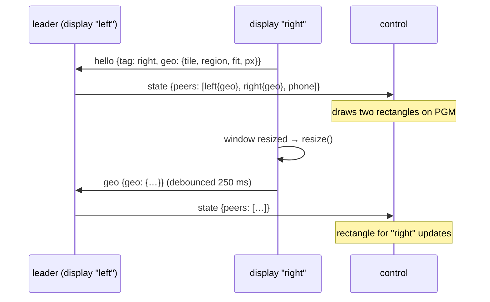
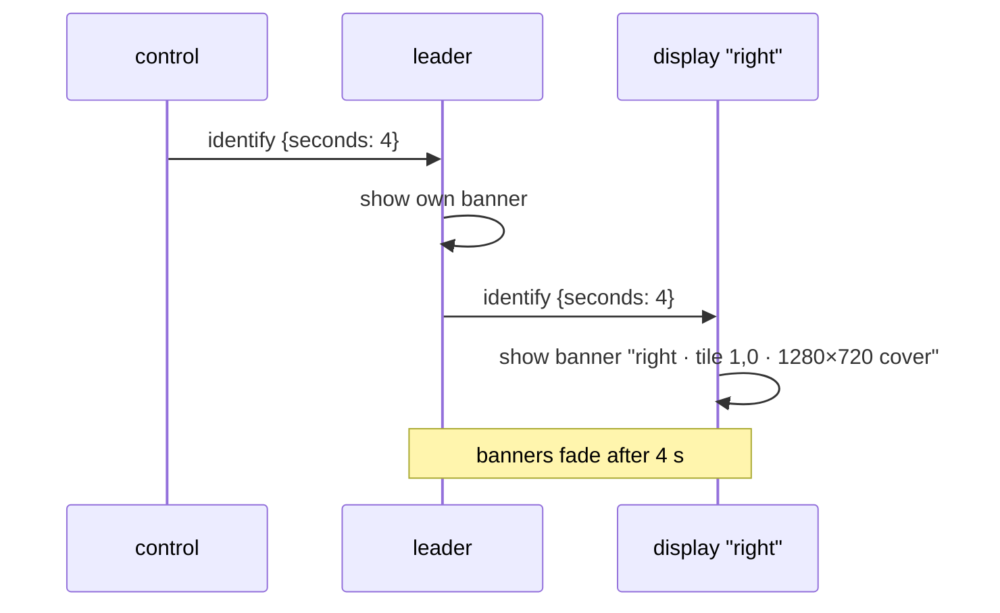

# RFC 0002: Display geometry on the wire, tile map, identify

| | |
|---|---|
| Status | Draft |
| Date | 2026-09-20 |
| Scope | Every display reports where it sits on the canvas; the control page draws that as an overlay on the program monitor; an *identify* button makes each display show which one it is. A later section sketches assigning tiles from the control page. |
| Depends on | RFC 0001 (PeerJS star: hello, `state.peers`). |
| Not in scope | Edge blending, unequal-tile authoring UI. This RFC gives them the data they need. |

## 1. Motivation

Setting up a wall is two questions asked over and over: *which physical screen is which
tile*, and *is the whole canvas covered, once, with nothing overlapping*. Today both are
answered by walking to each display and reading its URL. The control page can't help,
because a display's geometry never leaves the display: the hello carries role, tag,
browser and key, and the leader's `peers` list carries the same. Where the display sits on
the canvas is computed locally and stays there.

One extra field in two existing messages fixes that, and once the control page knows
every display's rectangle, the setup questions become a picture and a button.

## 2. Background

From the resolution-free canvas work:

- The show declares a canvas aspect, `"canvas": "16:9"`. Canvas units are `x ∈ [0, A]`,
  `y ∈ [0, 1]`, `A` the aspect. Every window shows some rectangle of that.
- A window's **tile** is what it was asked to show, from `?grid`/`?tile` or `?tile=x,y,w,h`,
  stored as `TILE` in normalized units (0..1, y down).
- Its **region** is what it actually shows, in canvas units, after `fit`: equal to the tile
  under `contain` (with bars) and `fill` (stretched), a centred sub-rectangle of the tile
  under `cover` (trimmed). Stored as `region = {X, Y, W, H}`.
- Its **view** is the pixel rectangle inside the window that shows the region.

The region is the truth about what is on the glass. The tile is the intent. The overlay
should show both when they differ.

## 3. Design

### 3.1 Geometry in the hello

The hello gains a `geo` object. Followers send it in their first message and again on
every change; the leader keeps the latest per follower and forwards it in `state.peers`.

```jsonc
{ "type": "hello", "role": "display", "tag": "left", "ua": "Chrome/151 MacIntel", "key": "…",
  "geo": {
    "tile":   { "x": 0,   "y": 0, "w": 0.5,   "h": 1 },   // normalized, y down: what was asked for
    "region": { "X": 0,   "Y": 0, "W": 0.889, "H": 1 },   // canvas units: what is shown (after fit)
    "fit":    "contain",                                   // contain | cover | fill
    "px":     { "w": 1920, "h": 1080, "vw": 1600, "vh": 1080 },   // window and view (drawn) size
    "aspect": 1.7778                                       // this window's canvas aspect, for mismatch detection
  } }
```

A `{ "type": "geo", "geo": {…} }` message carries updates after the hello, sent from
`resize()` when tile, region, fit or pixel size change, debounced to 250 ms so a window
being dragged doesn't flood the channel. The leader includes its own geometry the same
way it includes itself in `peers`.

`state.peers` becomes `[{ id, tag, role, ua, geo }]`. Control peers send `geo: null`.

Geometry from a follower is data the leader forwards, never something it acts on, so a
misbehaving peer can't move anyone else's tile. That matters more once 3.5 exists.



### 3.2 The tile map overlay

An `<svg>` element positioned exactly over the PGM monitor on the control page, with a
`viewBox` of `0 0 A 1` so canvas units are drawing units and no pixel math happens in
the overlay code. It redraws from `peerList()` on every `state`, which is once a second
and on every change.

Per display, in a colour keyed to its tag (a fixed palette indexed by a hash of the tag,
so a display keeps its colour across reconnects):

- **Region**: solid stroke, 2 px at monitor scale, light fill at 10 % opacity.
- **Tile**, only if it differs from the region: dashed stroke, no fill. This is the
  `cover` case; the gap between dashed and solid is what got trimmed.
- **Label** in the region's top-left: tag, then `1920×1080 contain` in smaller type. If
  the window's canvas aspect differs from the show's (a display running a stale
  `scenes.json`), the label gets a warning glyph.
- Under `contain`, the region equals the tile but the display has bars; the label says
  `contain` and that's enough.

Whole-canvas annotations, computed from all regions:

- **Overlap**: the intersection of any two regions, hatched. Two displays showing the same
  pixels is either an edge-blend setup or a mistake, and either way you want to see it.
- **Uncovered**: canvas area no region covers, tinted dark. Computed by rasterising the
  regions onto a small grid (64×36 is plenty) rather than polygon boolean ops.

```
 ┌──────────────────────────── PGM ────────────────────────────┐
 │▒▒▒▒▒▒▒▒▒▒▒▒▒▒▒▒▒▒▒▒▒▒▒▒▒▒▒▒▒▒▒▒▒▒▒▒▒▒▒▒▒▒▒▒▒▒▒▒▒▒▒▒▒▒▒▒▒▒▒▒▒│  ▒ uncovered
 │▒┌─────────────────────┐▒┌──────────────────────────────────┐│
 │▒│ left  1920×1080     │▒│ right  1280×720 cover  ╌╌╌╌╌╌╌╌╌ ││  ╌ tile (asked)
 │▒│ contain             │▒│                        ╎        ╎ ││  ─ region (shown)
 │▒│                     │▒│                        ╎        ╎ ││
 │▒│                     │▒│                        ╌╌╌╌╌╌╌╌╌ ││
 │▒└─────────────────────┘▒└──────────────────────────────────┘│
 │▒▒▒▒▒▒▒▒▒▒▒▒▒▒▒▒▒▒▒▒▒▒▒▒▒▒▒▒▒▒▒▒▒▒▒▒▒▒▒▒▒▒▒▒▒▒▒▒▒▒▒▒▒▒▒▒▒▒▒▒▒│
 └─────────────────────────────────────────────────────────────┘
```

A checkbox in the panel bar, *tile map*, toggles it; default on. The overlay is
HTML/SVG, not a GL pass: it can't affect the show, costs nothing when hidden, and works
the same on a phone.

### 3.3 Identify

A button, *identify*, sends `{ "type": "identify", "seconds": 4 }` to the leader, which
broadcasts it. Every display, the leader included, shows a full-window overlay for that
long:

```
        left
   tile 0,0  ·  1920×1080  ·  contain
   room qz8tk4  ·  via public
```

Tag large (about 15 % of the window height), the rest small, in the display's tile-map
colour on a translucent dark band, with the tile's outline drawn at the edge of the
view rect so the trimmed edges under `cover` are visible in the room too. It's a DOM
overlay over the canvas, like the stats box, so the show keeps rendering underneath.

Control pages don't show it; they sent it.



### 3.4 Where the geometry is computed

`resize()` already computes `view` and `region`. It gains one line at the end: if any of
tile, region, fit or pixel size changed since the last send, schedule `sendGeo()`
(debounced). `sendGeo()` is a no-op when there's no leader connection, and the hello
builder calls the same function to fill `geo`. No new state.

### 3.5 Later: assigning tiles from the control page

Not part of this RFC's implementation, but the data model should not preclude it.

Dragging or resizing a display's rectangle on the tile map sends
`{ "type": "setTile", "to": "<peer id>", "tile": {x, y, w, h} }` to the leader, which
forwards it to that follower only. The follower treats it exactly like a `?tile=`
parameter: updates `TILE`, calls `resize(true)`, and its next `geo` message confirms the
change on the map. It persists nothing; on reload it goes back to its URL. Persisting
would mean writing a layout file, which is the same "save to what?" question as
scenes.json and gets the same answer.

Two rules carry over from 3.1: only the leader forwards `setTile`, and only to the named
follower. A follower never accepts `setTile` from anyone but its leader, and a controller
can't reach a follower directly anyway in the star.

This is what makes unequal tiles, projector overlap for edge blending, and "nudge the
right screen 2 % left" a phone job instead of a URL job.

## 4. Failure modes

| Situation | Behaviour |
|---|---|
| Display running old code (no `geo`) | Shown on the map as a labelled dot at the canvas centre with "no geometry"; identify still works if the message type is unknown-but-ignored, else nothing. |
| Display's canvas aspect differs from the show's | Label gets a warning; its region is drawn in its own aspect, so the mismatch is visible as a rectangle of the wrong shape. |
| Two displays claim the same tile | Overlap hatch over the whole tile. Correct: that's what's happening. |
| Window resized while dragging between monitors | Debounced `geo` updates; the map lags by up to 250 ms. |
| Leader is a display with a hidden tab | `state` slows to once a minute (Chrome throttling); the map goes stale with it. Same fix as everywhere: displays are visible fullscreen windows. |
| Control page on a phone, tiny PGM monitor | Labels clamp to a minimum font size and the overlay hides the small text below a threshold width; the rectangles and colours still read. |

## 5. Implementation plan

1. `geo` in hello and `state.peers`; `geo` update message; debounced `sendGeo()` from
   `resize()`. Control peers send null. Half a day, including the test: the headless sync
   test asserts both displays' regions appear in the control's `peerList()`.
2. Tile map SVG over PGM with regions, tiles, labels, overlap hatch and uncovered tint;
   toggle. Half a day.
3. Identify message and display banner. An hour.
4. README section. Roadmap 7c marked done.

Section 3.5 is a separate change later, about half a day, and needs nothing that steps
1–3 don't already send.

## 6. Alternatives considered

- **Draw the overlay in GL on the PGM composite.** Would work, but it's UI, and keeping
  UI out of the render path is the point of the whole project. SVG is also trivially
  resolution-independent via `viewBox`.
- **Infer geometry from the URL the display loaded** (the leader could parse it). The
  leader doesn't know followers' URLs, `cover` trimming isn't in the URL, and section 3.5
  breaks it. Sending the computed region is simpler and true.
- **Identify by flashing the tile's area on the PGM monitor instead of on the displays.**
  That answers "where is it on the canvas," which the map already does. The room question
  is "which screen," and only the screen can answer that.
- **Send geometry only on request** (control asks, displays answer). Less traffic, but
  it's a few hundred bytes on resize and nothing otherwise; keeping it in the hello and
  `state` means late-joining controllers get it for free, like everything else.

## 7. Open questions

- Should the tile map also draw on the PVW monitor? PVW is one scene, not the wall, so
  probably not, but it could be a cheap way to preview a scene against the layout.
- Colour keyed to tag means two displays with the same tag get the same colour. Tags are
  supposed to be unique per room; the leader could reject a duplicate tag in the hello,
  which is a small, separate change.
- Persisting a layout set via 3.5: a `layout` block in `scenes.json` keyed by tag, applied
  by displays on load when present, overriding the URL? Decide when 3.5 is built.
