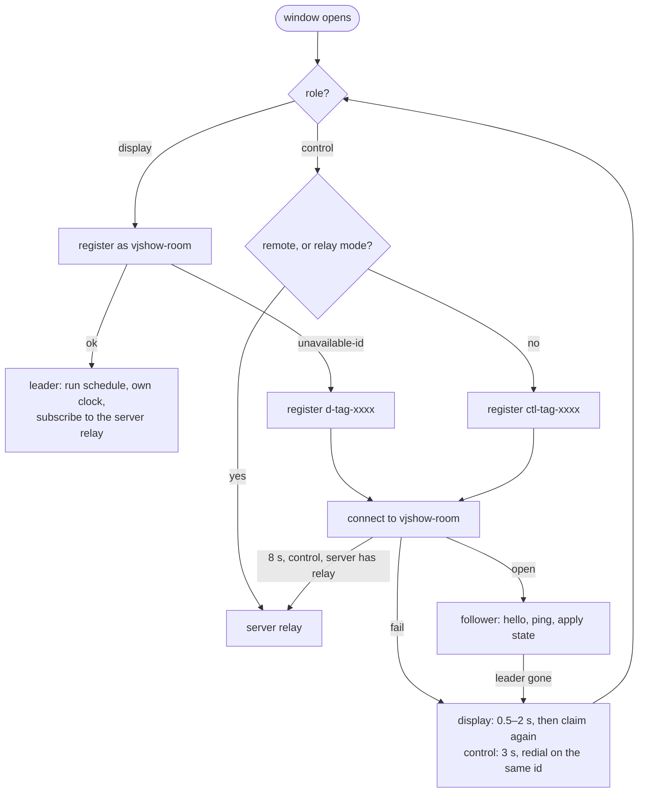
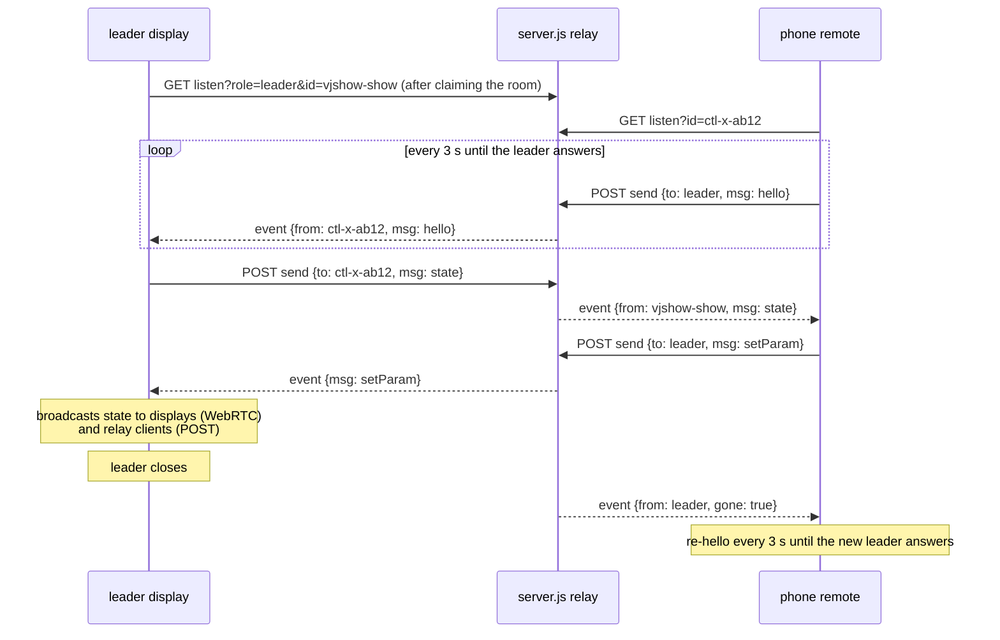

# How sync works

This is the current state of the sync system: how windows find each other, who is in
charge, what goes over the wire, and what happens when pieces disappear. It describes the
code as of 2026-09-27. [RFC 0001](RFC-0001-serverless-sync.md) is the original design and
the reasoning behind it; this document is the reference for what was actually built,
including everything added since (LAN rules, readable ids, layout, the server relay).

## The idea in one paragraph

Every scene is a pure function of show time and its parameters. So if every display
agrees on the clock and on the schedule, they render identical frames without sending a
single pixel. Sync is therefore a clock-and-state problem. One display is the **leader**:
it owns the show clock and the show state and broadcasts them. Everyone else is a
**follower**: displays render from the leader's state on a clock slewed onto the leader's,
and control pages send requests to the leader and display what it broadcasts.

## The pieces

| Piece | Where | Job |
|---|---|---|
| `index.html` | every window | the player; also the control page (`?mode=control`) and phone remote (`?mode=remote`) |
| PeerServer | `server.js` at `/peerjs`, or public `0.peerjs.com` | signaling only: hands out ids, relays WebRTC offers/answers. Never sees show data. |
| WebRTC data channels | peer to peer | all show traffic between displays, and between control pages and the leader when possible |
| Server relay | `server.js` at `/relay` | control traffic for control pages that can't open WebRTC to the leader |
| `scenes.json` polling | every window, every 5 s | scenes, params, canvas, saved layout, and `reloadToken`. Independent of sync. |

What needs the server and what doesn't:

- **Needs the server:** loading the page and scenes; `scenes.json` polling; a new window
  joining; electing a new leader (the PeerServer is the referee for who holds the room
  id); control pages using the relay.
- **Peer-to-peer only:** the show clock, the schedule, crossfades, param overrides, hold,
  layout, stats. Once the display channels are up, the displays keep playing in sync with
  the server gone.

## Which PeerServer

Resolved once at page load (`resolveServerKind`), from `?peerserver=` or
`scenes.json` `sync.peerserver`, default `auto`:

| Page served from | `auto` resolves to | Fallback |
|---|---|---|
| `*.github.io`, `file:` | public (`0.peerjs.com`, Google STUN) | none |
| a LAN address (`localhost`, `127.x`, `10.x`, `172.16–31.x`, `192.168.x`, `*.local`) | local (`/peerjs` on the page's origin, no STUN) | **none**: keeps retrying local |
| anything else | local | public, if local doesn't answer in 5 s |

The LAN rule exists because of the first install: a display that fell back to the public
server on an offline LAN silently ran its own clock forever (see the
[postmortem](postmortem-2026-09-26-first-lan-install.md), issue 2).

## Rooms and ids

A **room** is a name: `?sync=<room>`, else `scenes.json` `sync.room`. On the public
PeerServer the `scenes.json` room is ignored, so strangers visiting the GitHub Pages demo
never share a room; there the room only comes from `?sync=`.

PeerServer has ids, not rooms, so the room *is* an id. The ids in the server log:

| Id | Who |
|---|---|
| `vjshow-<room>` | the leader. Holding this id is what being leader means. |
| `d-<tag>-xxxx` | another display |
| `ctl-<tag>-xxxx` | a control page or phone remote |

`<tag>` is the window's `?id=`. Without one, a window picks a random tag and keeps it in
`sessionStorage`, so it survives a reload of that window but not the window closing.
Layout assignments are keyed by tag, so kiosks should have a stable `?id=`.

## Election by claim



- A **display** always tries to claim first. That's how a follower becomes leader when
  the leader dies: its retry is a claim.
- A **control** never claims and never counts as a tile. It keeps one PeerServer
  registration across retries and just redials, so a control waiting for a display is one
  line in the log.
- Until a page is connected to a leader it leads itself, so a lone display plays
  normally and a lone control page previews.

## What goes over the wire

Every channel starts with `hello` from the follower:

```jsonc
{ "type": "hello", "role": "display" | "control", "tag": "1", "ua": "Chrome/151 Win32",
  "key": "…" | null, "win": [1080, 1920] | null, "build": "k3x9q1" }
```

The leader checks `key` against its own `sync.key` / `?key=`. On a mismatch it answers
`rejected` and closes. `win` is the window size (control pages send null). `build` is a
hash of the page's script. The control page compares it against its own and flags any
display on older code (`OLD CODE on 2`), because that display would silently ignore newer
messages.

The leader broadcasts `state` on every change and every second:

```jsonc
{ "type": "state", "epoch", "cur", "nxt", "sceneStart", "fadeStart",   // the schedule, in show-clock seconds
  "overrides": { "<scene>": { "<param>": value } },                    // live slider values
  "hold": false, "stats": false,
  "layout": { "canvas": "9:4", "cols": 4, "rows": 1, "tiles": { "1": 0, "2": 1 }, "zoom": 1.5 } | null,
  "build": "…", "peers": [ { "id", "tag", "role", "ua", "win", "build" } ] }
```

A follower's copy of `state` plus its slewed clock *is* the show. That's what makes
failover seamless.

All messages:

| Message | From → to | Effect |
|---|---|---|
| `hello` | follower → leader | join; key check |
| `rejected` | leader → follower | wrong key; the follower stops trying |
| `ping` / `pong` | follower ↔ leader | clock sync and liveness, every 500 ms |
| `state` | leader → all | schedule, overrides, hold, layout, stats, peers |
| `geo` | display → leader | window resized; new `win` |
| `setParam`, `resetScene` | control → leader | slider moved; reset a scene's overrides |
| `jump`, `skip` | control → leader | *play now*; *next scene* |
| `hold`, `stats`, `layout` | control → leader | set those fields of state |
| `identify` | control → leader → all | every display shows its tag for 5 s |
| `reloadAll` → `reload` | control → leader → all | every display reloads, the leader last |

Rule: controls **ask**, the leader **decides** and broadcasts. A control's local change
(a slider, the layout) is echoed on its own screen immediately. For 1 s after changing the
layout, a control ignores the leader's layout, so a `state` already in flight can't snap
it back.

## The clock

- Each follower pings every 500 ms and computes `offset = t1 − (t0 + t2) / 2` from the
  leader's timestamp `t1` and its own send/receive times `t0`, `t2`.
- It keeps the last 16 samples and uses the one with the smallest round trip. Queueing
  delay only ever makes a sample worse, so the fastest one is the most honest.
- The first 4 samples are taken outright. After that the local offset **slews** toward
  the target at up to 30 ms per second, so time never visibly jumps, unless it's off by
  more than 250 ms, in which case it jumps.
- The slew runs from a 50 ms timer, not the render loop, so a throttled or hidden window
  still converges.
- The schedule also advances on a 100 ms timer on show time, not per frame, so an
  occluded leader keeps the show moving.

## Liveness and failover

| Watcher | Rule |
|---|---|
| follower | leader silent for 5 s → drop the channel and reconnect (displays claim) |
| leader | follower hasn't pinged for 10 s → drop it |
| PeerServer | releases a dead peer's id after its socket closes (`expire_timeout` 5 s) |

When the leader dies, followers keep rendering from their last state on their already
synced clocks. The first display whose claim succeeds becomes leader and simply keeps
scheduling from its mirrored state: nothing on screen changes. Hold, layout, stats and
overrides survive because they're in the mirrored state. They don't survive every display
reloading at once (the saved layout in `scenes.json` does).

**Known limit:** with the PeerServer unreachable, a display that loses the leader can't
rejoin or elect, and runs its own schedule until the server is back.

## Control pages and the server relay

Control pages have the hardest connectivity. They're often on a different network
position from the displays: a Mac on Wi-Fi and wired at once, or a phone on Wi-Fi. There
are three paths, tried in this order:

1. **WebRTC to the leader**, like a display. Works when both ends can find each other.
2. **Server relay**, if the page came from `server.js` (it probes `GET /scenes` for
   `relay: true`). The phone remote uses it straight away; a full control page switches to
   it when its WebRTC dial times out after 8 s. The status line says `via server relay`.
3. **Mic unlock**, when there's no relay (a static host) and the page is on `localhost`:
   ask for mic permission once, stop the tracks immediately, redial.

Why paths 2 and 3 exist:

- **Chrome on a multi-homed machine** only offers WebRTC candidates on the default-route
  interface unless the page has camera/mic permission. With the Mac's Wi-Fi first and the
  displays on wired LAN, it offers only Wi-Fi addresses and the displays can't reach it.
- **Phone browsers** hide their LAN address from WebRTC behind a random `*.local` name.
  The other side has to resolve it by multicast DNS. At the 2026-09-27 session the Mac's
  wired port could see the phone's mDNS announcements, but the phone's remote still never
  opened a channel to the leader. The exact cause wasn't pinned down; the relay made it
  irrelevant.
- The mic unlock can't help a phone: `getUserMedia` needs a secure context, and
  `http://192.168.x.x` isn't one.

### Relay protocol

Two endpoints on `server.js`, per room:

```
GET  /relay/<room>/listen?id=<id>[&role=leader]   server-sent events: { from, msg } or { from, gone: true }
POST /relay/<room>/send   { from, to, msg }        to = "leader" or a client id; 404 if nobody is there
```



- On the leader, each relay client is wrapped in an object with the same interface as a
  PeerJS `DataConnection` (`send`, `close`, `on('data'|'close')`, `peer`) and handed to the
  same `onFollower` as a WebRTC connection. So key checks, `peers`, pings and liveness are
  all identical: the leader doesn't care how a follower arrived.
- The server treats messages as opaque. It only routes by `to` and tells each side when
  the other's event stream closes (`gone`).
- The relay carries control traffic only. Displays never use it, so display sync stays
  peer-to-peer and survives the server going away. A control page on the relay loses the
  show while the server is down; nothing on screen does.

## Things that aren't sync but look like it

- **`reloadToken`** in `scenes.json`: change it and every display reloads on its next
  poll, whether or not it's in the room. The fallback for displays that can't be reached.
- **`scenes.json` layout**: applies when no live layout is set, so a saved layout
  survives a full restart.

## Failure modes

| Situation | What happens |
|---|---|
| Display loaded from a server with no PeerServer | Runs standalone; not in the room. On a LAN host it keeps retrying local rather than falling back. |
| Control page can't reach the leader over WebRTC | Relay after 8 s (LAN server); mic unlock on `localhost` (static host). |
| Display on old code | Control page shows `OLD CODE on <tag>`; newer controls don't reach it. *reload displays*. |
| Leader dies | Another display claims within a few seconds; no visible change. |
| Server dies | Displays keep syncing peer-to-peer. No joins, no elections, no relay, no `scenes.json` edits until it's back. |
| Mac's IP changes (DHCP) | Displays can't load or poll; they need the new URL. Reserve the Mac's address in the router. |
| Two windows with the same `?id=` | Both get the same layout tile; tags are meant to be unique. |

## Unifying on WebRTC later

Today there are two transports: WebRTC data channels for everything that can use them, and
the server relay for control pages that can't. The protocol on top is identical, and the
leader's relay adapter already looks like a `DataConnection`, so the split is contained.
Ways to get back to one:

1. **A TURN server on the LAN.** Run TURN next to `server.js` (coturn, or a small Node
   TURN) and add it to the local `iceServers`. Every browser, the phone included, then gets
   a *relay candidate* on the Mac's address, which everything on the LAN can reach. ICE
   picks it only when host candidates fail, so displays still connect directly and a phone
   goes through TURN. The `/relay` endpoints and the mic unlock could then go away: one
   transport, WebRTC everywhere. Cost: another service to run (and a dependency, where
   `server.js` is plain Express today), and TURN is heavier than a JSON relay for what is a
   few messages per second. **This is the recommended path if we unify.**
2. **Everything through the server** (WebSocket instead of data channels). Simplest code,
   but it gives up the property that displays keep syncing with the server gone, which
   saved the first install when the Ethernet adapter dropped. No.
3. **Keep both, formalise the seam.** Make "a connection to a peer" an interface with two
   implementations and pick per peer. That's roughly what exists now, minus the name. Fine
   indefinitely if TURN isn't worth running.

Also open: the relay is plain HTTP on the LAN with the same trust model as the save route.
A `sync.key` is still checked in `hello`, but the relay endpoints themselves are open to
anything on the network.
